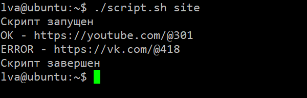

# CurlCheck

Простой Bash скрипт для проверки ответа сервера

**Задача**

Скрипт должен принимать переменную в виде url или файл со списком url (urls.txt). Нужно кратко и ясно выводить какой url какой код получил, а если ответ будет плохим (404, 502), вывести и завершить работу.

**Результат**

